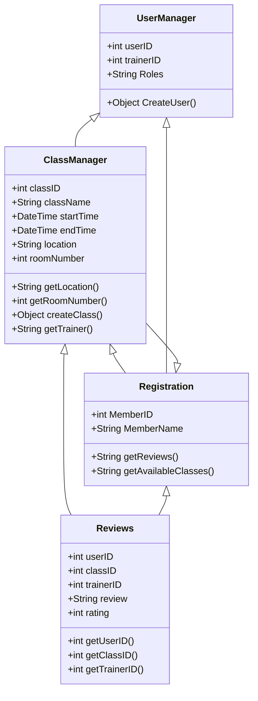

# Class Diagrams

```mermaid
classDiagram
    ClassManager<|--Registration
    ClassManager<|--Reviews
    class ClassManager{
        +int classID
        +String className
        +DateTime startTime
        +DateTime endTime
        +String location
        +int roomNumber
        +String getLocation()
        +int getRoomNumber()
        +Object createClass()
        +String getTrainer()
    }

    Registration<|--ClassManager
    Registration<|--Reviews
    class Registration{
        +int MemberID
        +String MemberName
        +String getReviews()
        +String getAvailableClasses()        
    }

    class Reviews{
        +int userID
        +int classID
        +int trainerID
        +String review
        +int rating
        +int getUserID()
        +int getClassID()
        +int getTrainerID()
    }
        UserManager<|--ClassManager
        UserManager<|--Registration
        class UserManager{
        +int userID
        +int trainerID
        +String Roles
        +Object CreateUser()

    }
```
