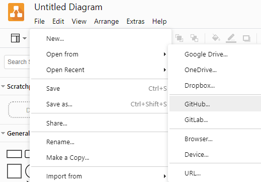

# Jump On It

## Group Members & Bounded Context

|Member Name|Bounded Context|Epic|
|-|-|-|
|Lucas|Registrations|As a member, I want to compare classes by their location, time, and reviews to select and schedule the best option for myself.|
|Sal|Location|As an instructor/employee of the gym, I want to find out where I can conduct a class.|
|Kaan|Reviews|As a user, I want to read and write comments/reviews on classes.|
|Nnamdi(Ken)|User Management|As a gym administrator, I want to register, manage, and remove different types of users.|
|Jim|Class Management|As a trainer, I want to manage classes, so that members can choose the best options for themselves.|

## Important Links

|Link Name|Description|
|-|-|
|[Canva](https://www.canva.com/design/DAE6PnR01N8/5ZpPkwHJPwh14IRhRGzZPg/edit)| Where we'll keep our presentations|

## Diagrams

Steps to access our diagrams from GitHub through app.diagrams.net

1. Go to [app.diagrams.net](https://app.diagrams.net/).
2. Sign-In
3. Go to `File`-->`Open from`-->`GitHub`  
4. Click on `Enter Value` and paste in `https://github.com/jbkayoz13/Jump-On-It`  
5. After that, navigate to the documentation folder within the GitHub repo (while still using Diagrams.net) and click on Diagrams.drawio and then `authorize`  
6. That's it! It should pull in the diagrams from the file in our GitHub repo. It'll create a commit every time you save **which is fine!** Commit early and often, everything is under version control so we can roll it back if things get weird.  

## High Level Functionality Resources

|Function|Options|Helpful Links|
|-|-|-|
|Calendar|Webix Full Tui Calendar React Big Angular Calendar  |[Medium's Top Five](https://webix-ui.medium.com/5-best-javascript-calendar-libraries-411c51061cf5#:~:text=%205%20Best%20JavaScript%20calendar%20Libraries%20%201,nodes.%20The%20calendar%20does%20not%20offer...%20More%20) [Flat Logic's Recommendations](https://flatlogic.com/blog/top-javascript-calendar-plugins/#:~:text=%20Top%20javascript%20calendar%20libraries%20%201%20Fullcalendar.io.,unlike%20most%20calendar%20plugins%2C%20doesn%E2%80%99t%20generate...%20More%20) [Mobiscroll Appointment Booking](https://demo.mobiscroll.com/javascript/calendar/appointment-booking) [Angular Appointment Booking Microservice](https://www.angularcode.com/appointment-booking-microservice-using-javascript-fullstack/)|  

## Technical Stack Resources

|Frameworks & Tools|Helpful Links|
|-|-|
|Spring Boot|[geeksforgeeks-Spring Boot](https://www.geeksforgeeks.org/introduction-to-spring-boot/)|
|Spring Framework|[geeksforgeeks-Spring Framework](https://www.geeksforgeeks.org/introduction-to-spring-framework/)|
|Why Spring?|[Spring.io](https://spring.io/why-spring)|
|Required & Provided Interfaces|[Required & Provided Interfaces - Martin Fowler](https://martinfowler.com/bliki/RequiredInterface.html)|
|Convert a JSON request to a Class Model|[jsonschema2pojo](https://www.jsonschema2pojo.org/)|
|Consuming information from Rest APIs|[Consuming a Restful Web Service](https://spring.io/guides/gs/consuming-rest/)|

## Important Information

|Key Decisions|Outcome|
|-|-|
|Back-end Programming Language|Java|
|Framework|Spring Boot|
|Template Framework|Thymeleaf|

## Mermaid Test

### What is this?

You can find more info here: [Mermaid on GitHub](https://github.blog/2022-02-14-include-diagrams-markdown-files-mermaid/)  
TL;DR -- It's a JavaScript based language that will give us the ability to include diagrams via markdown.  
We could use this for some of the later diagrams in the course if we think it's easier. See example below!  

Some more good resources can be found here: [Mermaid Documentation](https://mermaid-js.github.io/mermaid/#/README)  

Let me know what you all think about this when you see it. I don't mind creating our documentation via markdown.

